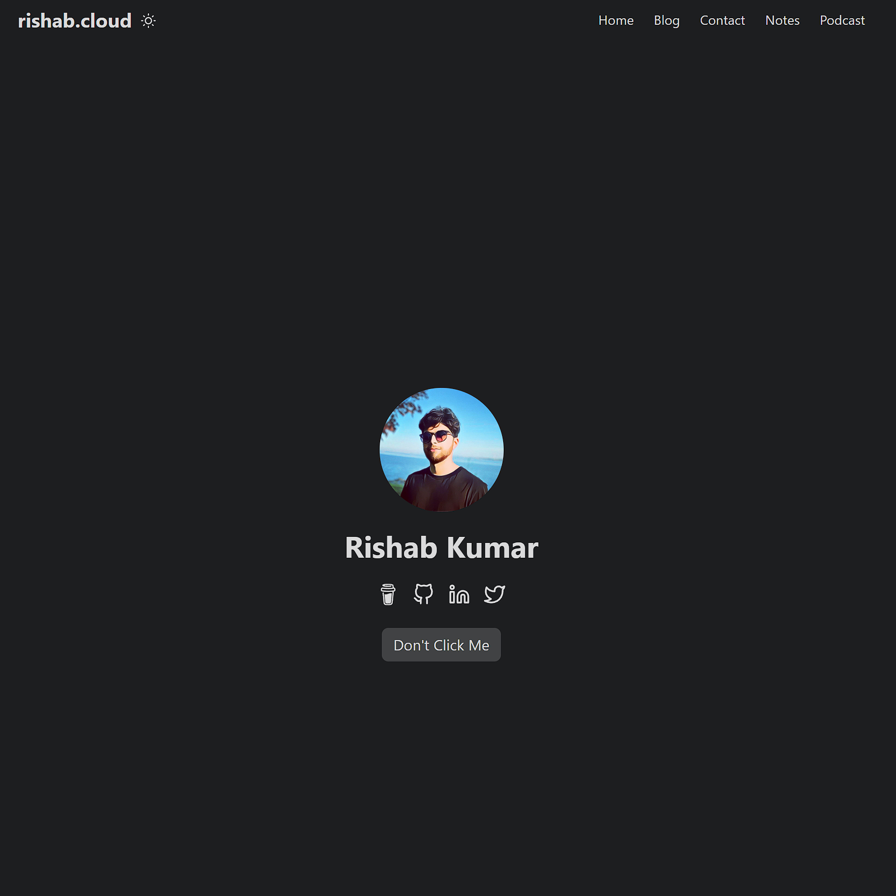
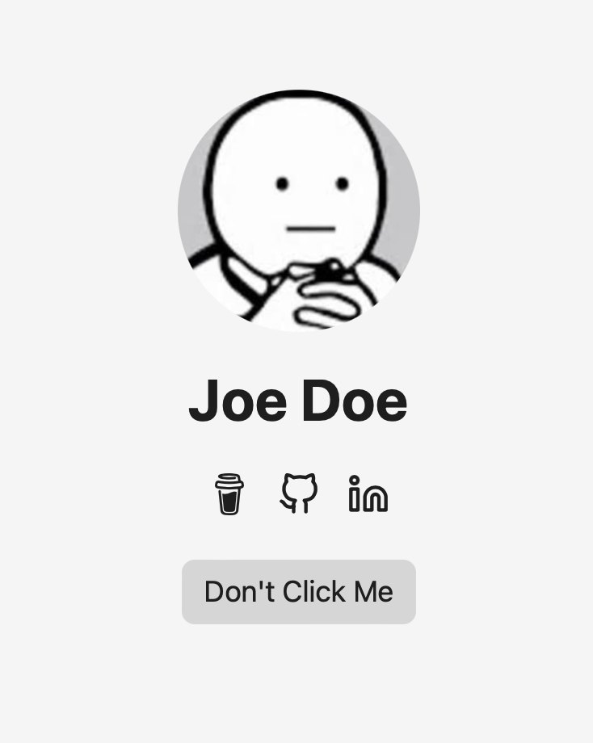

### rishab.cloud

Hi, I am Rishab and this is my personal portfolio based on [theme template](https://github.com/nanxiaobei/hugo-paper).



## Quick Start

1. Install [Hugo](https://gohugo.io/installation/)
2. Install [Git](https://git-scm.com/book/en/v2/Getting-Started-Installing-Git)

**Open your terminal or command line**

1. Create a new folder 'my-personal-blog'

```console
mkdir 'my-personal-blog'
```

2. Go into this folder

```console
cd 'my-personal-blog'
```

3. Initialize an empty Git repository in the current directory

```console
git init
```

4. Clone this repository into your folder

```console
git clone 'https://github.com/charlola/hugo-theme-charlolamode.git'
```

5. Start Hugo's development server to view the site locally.

```console
hugo server
```

Once the local server starts, you can see your site. If your web-browser does not automatically pop up, open your browser and enter <http://localhost:1313>. Now you can start to modify this page in the directory. If you save new changes, this site will automatically refresh and render the modification.

## Export and import Hashnode posts

Export Hashnode posts into local JSON, Markdown, and image files:

```console
HASHNODE_TOKEN=your_api_key npm run export:hashnode -- --publication=blog.rishabkumar.com
```

The exporter defaults to Hashnode's Pro GraphQL endpoint, `https://gql-beta.hashnode.com`.
Override it with `HASHNODE_API_URL` if Hashnode shows a different endpoint in your dashboard.
It also writes post-level analytics counters to `hashnode-export/blog.rishabkumar.com/analytics/posts.json`
and `hashnode-export/blog.rishabkumar.com/analytics/posts.csv`.

To export drafts too:

```console
HASHNODE_TOKEN=your_api_key npm run export:hashnode -- --publication=blog.rishabkumar.com --include-drafts
```

To export only drafts:

```console
HASHNODE_TOKEN=your_api_key npm run export:hashnode -- --publication=blog.rishabkumar.com --drafts-only
```

Then import the exported JSON into Hugo Markdown:

```console
npm run import:hashnode -- hashnode-export/blog.rishabkumar.com/posts/json
```

The importer writes posts to `content/blog/*.md` and local images to `static/images/blog/`.
Preview the import without writing files:

```console
npm run import:hashnode -- hashnode-export/blog.rishabkumar.com/posts/json --dry-run
```

If you need to re-run the import over existing files:

```console
npm run import:hashnode -- hashnode-export/blog.rishabkumar.com/posts/json --overwrite
```

Drafts are exported under `hashnode-export/blog.rishabkumar.com/drafts/json`. Import them with
`--include-drafts`; they stay marked as Hugo drafts.

After import, review embeds, images, redirects, and post metadata before publishing.

## Open Visual Studio Code to edit your Blog

3. Open your favorite Editor like [Visual Studio Code](https://code.visualstudio.com/download)

### Basic Configuration

The config.yml is your best friend. You can modify and add information, such as ...

- Title of the page
- Your Name
- Social Icons
- Buttons



You can easily add social icons like LinkedIn, Twitter, Youtube, Instagram, ... just have a look in the config.yml. Examples are already added.

### Change Profile Image

To add your profile pic, replace ***profil.png*** in the folder ***static/images***. Make sure you take an image with a happy face :)

### Add tabs

In the config.yml you can add new tabs next to 'Articles' and 'Contact'. Uncomment 'Category' to check it out.

***Note***
If you add a new tab in the config.yml, you have to do the following:

1. Add new folder in the directory 'content' with the ***same name*** as the new tab.
2. Copy ***_index.md*** from articles into new folder.

### Add new content

If you like to push new content, create a new Markdown file in the new folder. Find an example in ***content/articles/article.md***.

## Thank you

I'd love to get feedback. Send a message via LinkedIn. Feel free to support this page with a [coffee donation](https://ko-fi.com/heycharlola) :)

## Online Website

To push your website online, use Azure Static Web or Netflify. I used Azure Static Web.
